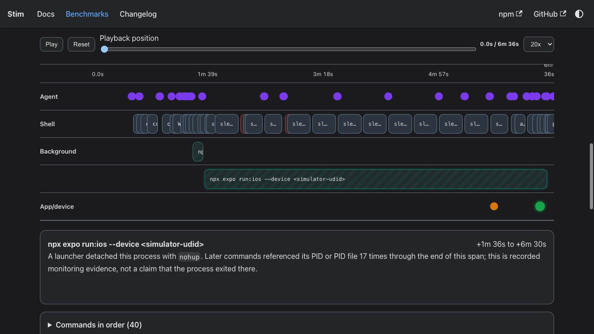
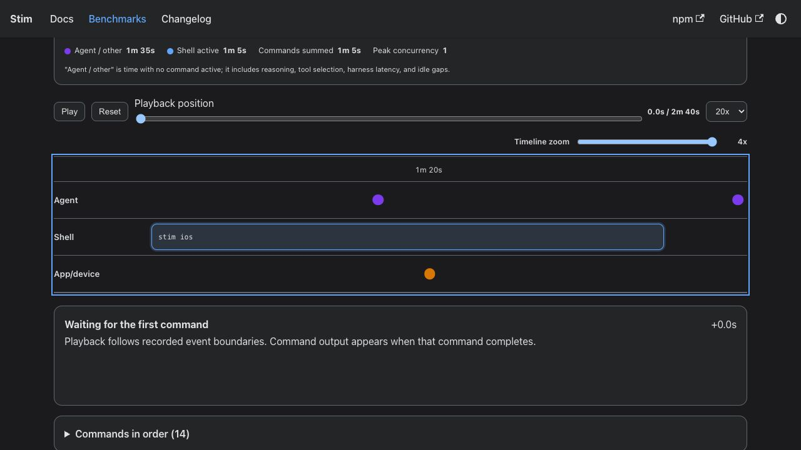

# Agent benchmark v4

Date: 2026-09-03. Issue: #287. This protocol extends the v3 agent benchmark
with rendered-screen readiness and published simulator-pool behavior. Its
timings are a new, non-comparable block because v3 stopped at process liveness,
did not navigate the app, and created a new simulator for every run.

## Question and pilot gate

The primary question is whether Stim reduces elapsed time from agent dispatch
to a changed Trailhead app visibly ready on its Settings screen. JavaScript and
native changes are different workloads and are never combined into one run or
one headline number.

The first pilot contains four sequential cells, all on `gpt-5.6-luna`:

| Change     | Arm     | Simulator state                     |
| ---------- | ------- | ----------------------------------- |
| JavaScript | Stim    | adopt the prepared parked simulator |
| JavaScript | Control | create a new simulator              |
| Native     | Stim    | adopt the prepared parked simulator |
| Native     | Control | create a new simulator              |

Do not dispatch another model until the Luna report and visual evidence are
reviewed. Later model blocks keep the same pins and cell definitions. Results
from different change kinds, models, or deliberately changed pins remain
separate.

## Pins and preparation

Pin the exact published `stim-cli` version and package integrity, fixture
commit, Codex version, model, reasoning effort, service tier, `agent-device`
version and executable hash, Node.js, CocoaPods, macOS, Xcode, iPhone model,
and iOS runtime before preparing the block. The Luna pilot uses published
`stim-cli@1.0.0-rc.12`, iPhone 17, and iOS 26.5.

Preparation runs outside the timer. It creates one Stim-owned simulator, warms
the fixed fixture, removes its seed worktree, and verifies that cleanup parked
the simulator. The golden must contain exactly one available, shut-down pool
record whose device name starts with `stim-parked`, plus the matching iOS build
artifact. Set the opt-in parked capacity explicitly for every command that uses
the isolated benchmark `STIM_HOME`.

Before each dispatch, verify the package version and integrity, fixture commit,
clean main checkout, golden build artifact, exact parked simulator identity and
state, required disk space, no benchmark-owned process from an earlier run,
and no unexpected listener on Metro ports 8081 through 8090. Wait for a
one-minute load average at or below 3.0 for two consecutive 15-second samples.
Runs are sequential.

Give the campaign its own `AGENT_DEVICE_STATE_DIR`, separate from the
operator's normal sessions, and set `AGENT_DEVICE_SESSION` to the exact run id.
The runner environment is not proof that nested shell tools inherit those
values: repeat both assignments explicitly on every `agent-device` command.
Before dispatch, require an empty session inventory and no ownership claim on
the prepared simulator. If prior campaign state cannot be proven clean, stop
the daemon with `daemon stop --clean` against that campaign state directory
before starting the timer. Never stop the operator's global daemon.

## Fixed changes

The JavaScript cell changes only the Settings Offline maps subtitle:

```diff
-subtitle="Keep map tiles for saved trails on device"
+subtitle="Keep saved trail maps available offline"
```

The native cell changes only `ios/Trailhead/AppDelegate.swift`, immediately
after the existing window assignment:

```swift
window?.accessibilityIdentifier = "Trailhead <run-id>"
```

The native marker must appear as the live app window label in the
`agent-device` accessibility snapshot. This proves that the changed compiled
AppDelegate executed; searching an optimized Swift executable for an ASCII
literal is not sufficient.

## Arm isolation

Each run uses a disposable runner home and starts in the clean fixture main
checkout. The Stim profile exposes only the pinned Stim skill and the
independently pinned `agent-device` skill. The control profile exposes only
`agent-device`; the Stim binary and skill are unavailable. Both profiles have
the same model settings, filesystem authority, and app task.

The agent creates its own worktree after dispatch. Stim must use this exact
slash-containing form, which also exercises branch/path handling:

```text
stim worktree create bench/<run-id> --dir <worktree-parent> --carry-ignored
```

The Stim worktree must therefore use Git branch
`worktree-bench/<run-id>`. Its filesystem leaf may encode the slash. The
control creates the corresponding Git worktree using local Git. Both carry the
same installed dependencies and native outputs from the fixture checkout.

The Stim arm uses the inherited isolated `STIM_HOME`, invokes the pinned RC as
exactly `stim`, requests iPhone 17 and iOS 26.5, and must report adoption of the
prepared simulator. The control must not inspect that home or use Stim; it
creates a new benchmark-named iPhone 17 on iOS 26.5.

## Settings readiness proof

App-process liveness is retained as a secondary milestone. The primary
readiness endpoint is completion of the successful Settings screenshot command
after the expected changed content is present. Copying that PNG into retained
results is a validity gate, not a later timing endpoint.

After launch, every agent must use `agent-device`. The required command
sequence is:

```text
env AGENT_DEVICE_STATE_DIR=<campaign-state> AGENT_DEVICE_SESSION=<run-id> agent-device open com.appandflow.trailhead --foreground --platform ios --udid <run-udid>
<handle Expo onboarding if it appears and navigate by semantic label to Settings>
env AGENT_DEVICE_STATE_DIR=<campaign-state> AGENT_DEVICE_SESSION=<run-id> agent-device wait text "<expected text>"
env AGENT_DEVICE_STATE_DIR=<campaign-state> AGENT_DEVICE_SESSION=<run-id> agent-device screenshot /tmp/<run-id>-settings.png
cp /tmp/<run-id>-settings.png <run-dir>/proof/settings.png
env AGENT_DEVICE_STATE_DIR=<campaign-state> AGENT_DEVICE_SESSION=<run-id> agent-device close
```

Record each proof step as its own top-level shell command. Do not hide proof in
an interactive shell, script, chained command, or redirected background job.
Using a bare or mismatched agent-device state directory/session, or restarting
its daemon inside the timed interval, invalidates the attempt. The collector
also requires `open` and `close` output to name the exact run session; command
shape alone is insufficient.

The agent reads `<run-udid>` from the Stim result or control simulator-creation
output. The explicit UDID prevents an existing automation session from
selecting unrelated hardware; a bundle identifier alone is insufficient. The
temporary screenshot path avoids Simulator write restrictions on external
volumes. JavaScript waits for `Keep saved trail maps available offline`; native
waits for `Offline maps`.

The collector accepts the screenshot only when the targeted open command names
the same UDID recorded by the independent app watcher, all required commands
completed in order after dispatch, the PNG has a valid signature and
dimensions, its timestamps fit the run, and the copied file exists. The
JavaScript source and captured Metro bundle must contain the changed subtitle.
Native must have the exact run marker in the live window accessibility node.
Missing proof makes the attempt invalid even when the app process is alive.

The initial Luna pilot predated this UDID-binding correction. Its retained
launch, watcher, command, and screenshot evidence shows the changed JavaScript
subtitle or run-specific native accessibility marker on the intended
simulator, so those four attempts remain valid. Any later block must use the
explicit UDID command above.

## Metrics and records

The primary metric is `dispatchToScreenReadySeconds`: dispatch to completion
of the successful, validated `agent-device screenshot` command. Report
`dispatchToAppAliveSeconds` separately. Also retain command count, raw token
fields, worktree and simulator evidence, cache and adoption/build output, and
invalid-attempt reasons.

The coordinator timestamps every runner event and reconstructs every command's
start, end, duration, exit status, and output. The website's interactive
benchmark viewer provides per-run tabs, agent messages, non-overlapping command
lanes, inferred spans for detached processes that later process-inspection
commands monitor, app-alive and screen-ready milestones, terminal output
drill-down, timeline zoom and playback, a concise evidence-derived activity
summary, token usage, estimated token cost, and the proof image. A detached
span ends at the last recorded PID or PID-file
reference; it does not assert that the process exited then. Exported website
data includes only valid attempts and uses relative paths and redacted device
identifiers. Private raw results retain invalid attempts for diagnosis. The
Markdown report is the machine-readable summary; the viewer is an audit view
and does not redefine metrics.





Export a completed block into the website with:

```bash
node scripts/export-benchmark-viewer.mjs \
  /path/to/results/<stage> \
  website/src/data/benchmarks/<stage>.json \
  website/static/benchmarks/<stage> \
  /path/to/sanitized-machine.json
```

The optional machine JSON contains only `model`, `chip`, and `memory`. The
exporter combines those fields with the recorded macOS, Xcode, Node, simulator
model, and simulator runtime. Never include a hostname, serial number, hardware
UUID, username, device UDID, or path in that file.

The exporter refuses data that still contains a local username or an absolute
home, volume, temporary, or simulator path. It omits machine-global process,
device, storage, and branch listings, plus interactive shell transcripts whose
cursor-control output cannot be made portable. Review the generated diff before
publishing because command output can contain other project-specific data.

Invalid attempts are immutable audit records. Fix only a coordinator defect or
environmental prerequisite, then reschedule the same cell under a new run id.
Never relabel an invalid attempt to improve a result. Collector-only proof
logic may be corrected without rerunning when preserved live evidence already
demonstrates the intended invariant.

## Cleanup

After collection, close the exact run-scoped `agent-device` session and verify
that the campaign session inventory is empty before a simulator can be parked
or reused. If closure cannot be proven, stop and clean only the campaign-owned
daemon. Remove the temporary screenshot and terminate only benchmark-owned
processes. For Stim, run
`stim stop` and `stim worktree remove --force`, then verify that the same
simulator is shut down, renamed as parked, and is the sole pool record. For
control, remove its worktree and branch and shut down and delete only the newly
created benchmark simulator. Do not touch unrelated physical-device leases or
automation sessions.

## JavaScript launch-crash extension

A launch-crash diagnostic is a separate suite, not a fifth performance cell.
Inject a deterministic root-render JavaScript exception before the first app
screen, then give each agent the same repair task. Compare dispatch to the
first actionable diagnosis, commands and tokens to diagnosis, and dispatch to
a repaired Settings screenshot. The Stim arm must preserve `stim ios` launch
output and `stim logs --errors`; control collects the equivalent Metro and
simulator logs manually. The injected error text is unique per run so the
collector can prove that the reported stack and repair refer to this failure.

The coordinator creates a per-run fixture branch, injects and commits the
exception, and checks out that fixture before dispatch, outside the timed
interval. The agent starts in the fixture checkout and creates its own isolated
run worktree from that HEAD, so worktree setup remains part of the measured
workflow. The agent must launch before inspecting source. An actionable
diagnosis contains both the run's unique error token and the root-layout source
location. A valid repair removes that token, relaunches the app, and reaches the
unchanged Settings proof on the same explicitly targeted simulator. Report
diagnosis and repair timing separately; do not add crash-suite results to the
readiness charts.

Run the crash suite only after the four-cell readiness pilot is accepted. Keep
its goldens, prompts, metrics, and report separate from the normal JS/native
speed results.
